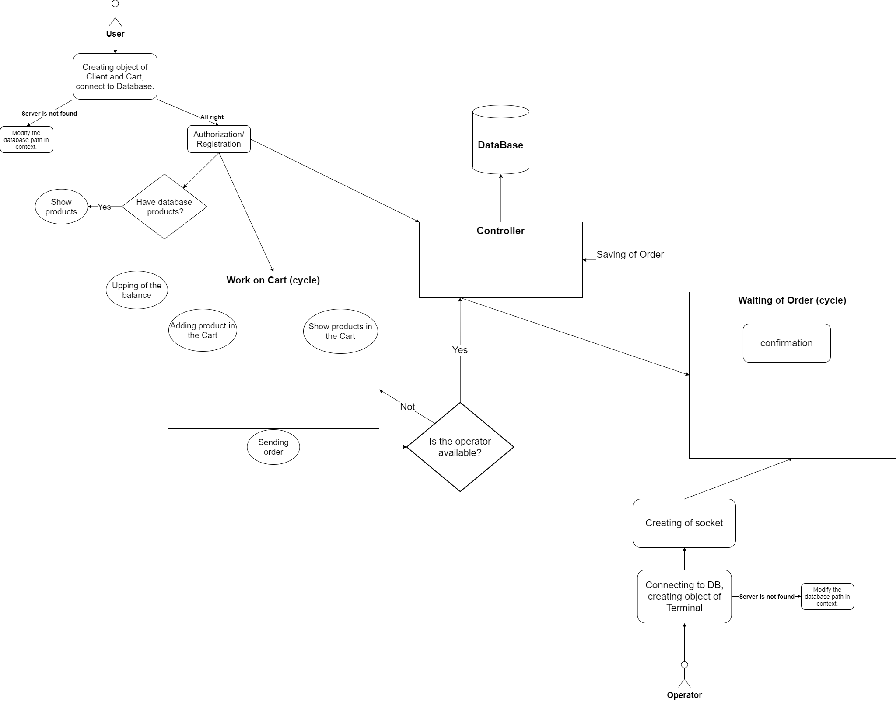

# DistributionOfOrdersCRM
 
Приложение, соединяющее функции создания и отправки заказов продукции и CRM системы, управляемой сотрудником персонала, подтвеждающего заказы.

## Как запустить?
Запуск происходит через program.cs находящийся в проекте DoO_CRM.Client_INTERFACE. 
Обратите внимание, что при запуске будет произведён поиск базы данных, название которой указано в строке подключения класса контекста (DoO_CRMContext). Измените её так, что-бы подключение происходило к имеющейся у вас базе данных.

### Как оно работает? (схема)
 

### Для чего оно было создано?
  - Изучение работы сокетов.
  - Изучение новой (для автора) платформы NET.Core
  - Практика разработки CRM систем.

##### Специальные благодарности:
KurnakovMaksim - https://github.com/KurnakovMaksim
(помощь в создании этого файла и тестировании приложения)
